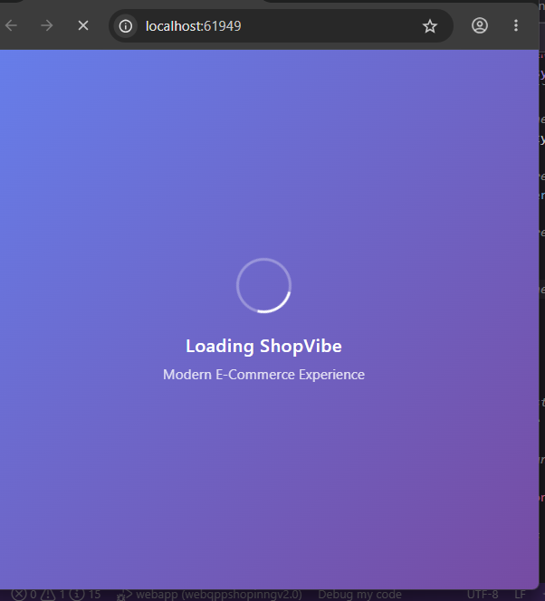
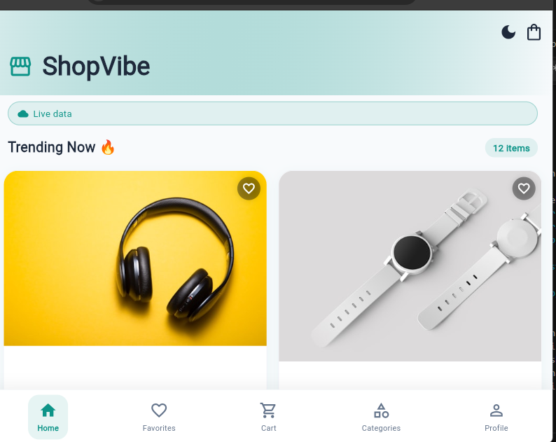
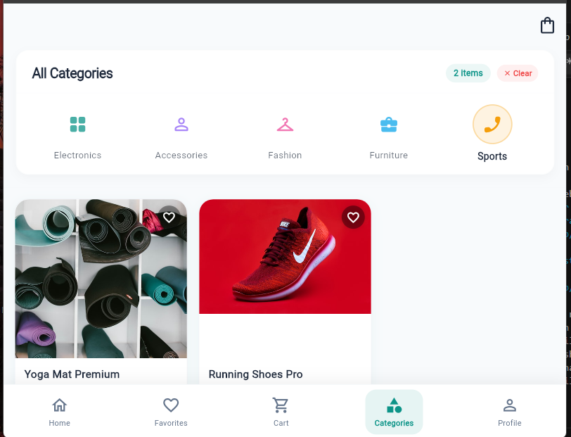
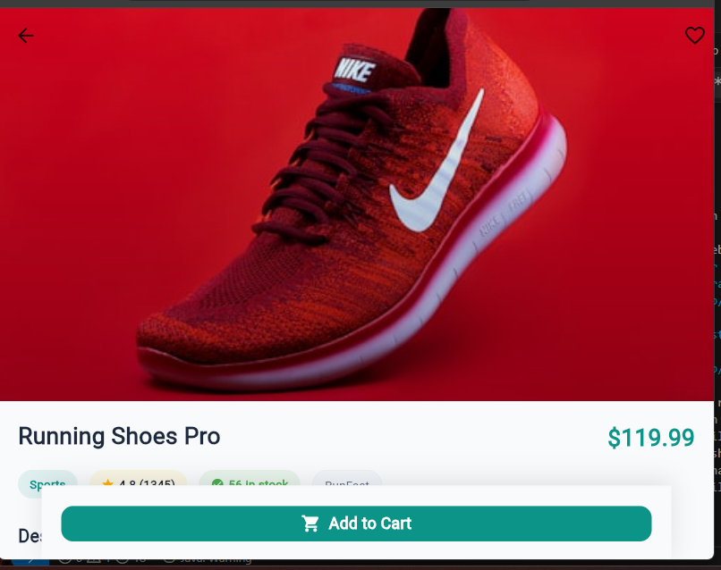
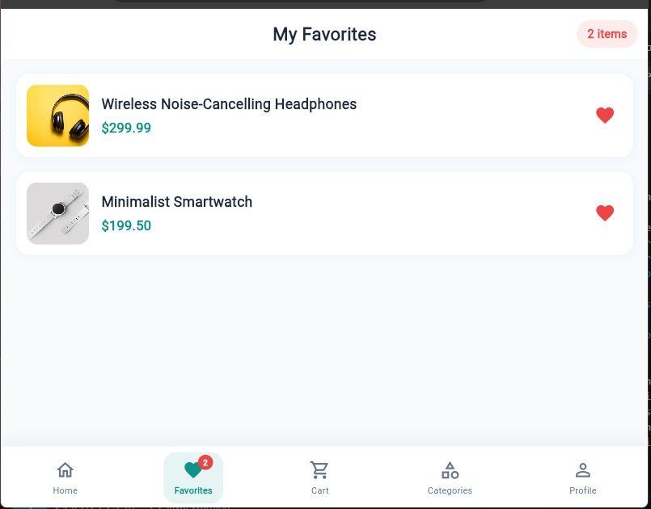

# firebase-ecommerce-flutter-web
Professional Flutter Firebase E-Commerce Web Application with Offline Support, Product Details, Integration, Responsive UI/UX, and Clean Architecture.

## Features

* Firebase Firestore Integration
* Dynamic Product System
* Product Details Screen
* Category Filtering
* Add to Cart UI
* Responsive Flutter Web Design
* Offline / Online Support
* Local Cache Storage
* Loading & Error States
* Retry Mechanism
* Smooth Page Transitions
* Clean Architecture
* Professional UI/UX

## Technologies Used

* Flutter Web
* Dart
* Firebase
* Cloud Firestore
* SharedPreferences
* Provider State Management

## Project Structure

```text id="r8v2ws"
lib/
 ├── data/
 ├── models/
 ├── services/
 ├── repositories/
 ├── providers/
 ├── screens/
 ├── widgets/
 ├── theme/
```

## Screenshots
### Loading Screen

### Home Screen

### Product Screen

### Detailes Screen

###Favorite Screen

## Firebase Features
* Dynamic product fetching
* Cloud Firestore integration
* Real-time product updates
* Offline product caching

## Application States

* Loading State
* Success State
* Error State
* Empty State
* Retry Handling

## Deployment

The project is optimized for:

* GitHub
* Netlify
* Flutter Web Production Build
## Run The Project

flutter pub get
flutter build web
```


## dev zakaria alamrri 
